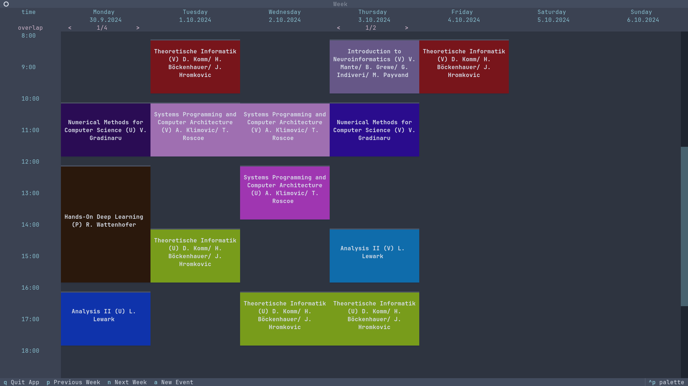
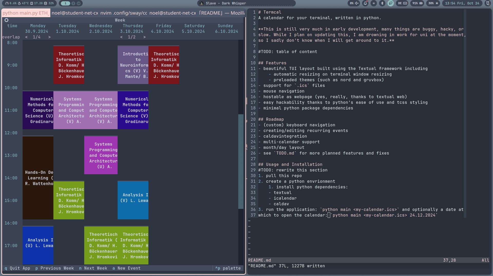
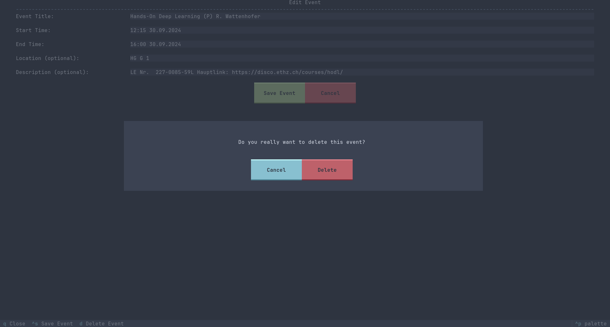

# Termcal
A TUI calendar for your terminal, written in python.

**⚠️This is still very much in early development, many things are buggy, hacky, or
slow. While I plan on updating this, I am drowning in work for uni at the moment,
so I sadly don't know when I will get around to it.⚠️**

# Table of Content

<!-- vim-markdown-toc GFM -->

* [Features](#features)
* [Roadmap](#roadmap)
* [Usage and Installation](#usage-and-installation)
* [Gallery](#gallery)

<!-- vim-markdown-toc -->

## Features
- beautiful TUI layout built using the Textual framework including
    - automatic resizing on terminal window resizing
    - preloaded themes (such as nord and gruvbox)
- support for `.ics` files
- mouse navigation
- hostable as webpage (yes, really, thanks to textual web)
- easy hackability thanks to python's ease of use and tcss styling
- minimal python package dependencies 

## Roadmap
- (custom) keyboard navigation
- creating/editing recurring events
- caldav integration
- multi-calendar support
- month/day layout
- dmesg notifications
- see `TODO.md` for more planned features and fixes

## Usage and Installation
1. pull this repo
2. create a python environment & install python dependencies:
    - textual
    - icalendar
    - caldav
3. run the application: `python main <my-calendar.ics>` and optionally a date at
which to open the calendar: `python main <my-calendar.ics> 24.12.2024`

## Gallery

